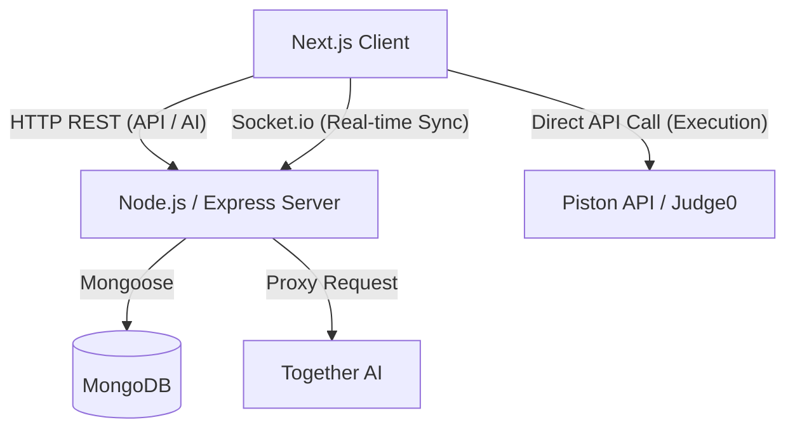

# Collab Code Editor — System Architecture

## Overview
Collab Code Editor is a real-time, collaborative code execution environment. It enables multiple developers to join a shared room via a unique ID, write code synchronously across various languages, execute that code remotely, and consult an AI assistant for debugging and suggestions—all without leaving the browser.

## High-Level Architecture Diagram

## Technology Stack
### Frontend (Client)
- **Framework**: Next.js 15 (App Router)
- **Language**: TypeScript
- **State Management**: Zustand
- **Code Editor**: Monaco Editor (`@monaco-editor/react`)
- **Real-time Engine**: Socket.io-client
- **Authentication**: Clerk (`@clerk/nextjs`)
- **Styling**: Tailwind CSS & Framer Motion
- **Code Execution**: Piston API / Judge0 (Called directly from Client)

### Backend (Server)
- **Framework**: Node.js with Express
- **Language**: TypeScript
- **Real-time Engine**: Socket.io
- **Database**: MongoDB (via Mongoose)
- **Logging**: Winston
- **AI Integration**: Together AI SDK (`@together-ai/sdk`)

## Core System Components

### 1. Real-Time Collaboration Engine
The heart of the application is the synchronization of the Monaco Editor instances across multiple browsers.
- **Connection**: Established via `client/src/lib/socket.ts`.
- **Rooms**: Users join specific "Rooms" identified by a UUID. The Socket.io backend places connections into corresponding socket rooms (`socket.join(roomId)`).
- **Code Syncing**: 
  - The client debounces local typing events (500ms) and emits `code-change`.
  - The server receives `code-change`, saves the current state to MongoDB (for persistence/late-joiners), and broadcasts `receive-changes` to all *other* clients in the room.
  - *Known Scalability Bottleneck*: Currently, the server writes to MongoDB on *every* debounced keystroke. In a production environment, this should be replaced with an in-memory datastore like Redis for active rooms, flushing to MongoDB periodically or on room closure.

### 2. Code Execution Pipeline
Code execution is offloaded to remote, sandboxed APIs (Judge0/Piston) to prevent arbitrary code execution vulnerabilities on our own servers.
- **Trigger**: User clicks the "Run Code" button (`RunButton.tsx`).
- **Store Logic**: The Zustand store (`useCodeEditorStore.ts`) fetches the current code (or falls back to fetching it from the DB if local state is out of sync) and sends an HTTP POST request to the execution API.
- **Response Handling**: The store parses the JSON response, sorting it into `stdout`, `stderr`, or `compile_output`, and updates the global `executionResult` state, which the `OutputPanel` listens to.

### 3. AI Assistant Proxy
The AI assistant provides coding help and context-aware suggestions directly within the editor.
- **Frontend**: A resizable, sliding panel (`AI-Assistant.tsx`) built with Framer Motion.
- **Backend Proxy**: To prevent exposing the Together AI API key to the client, all AI requests are routed through the Node.js server (`/api/ai/ask-ai` and `/api/ai/ask-suggestion`).
- **Context Injection**: When a user asks a question, the client silently appends the *entire current content of the Monaco Editor* to the prompt. The backend controller formats this into a standard system/user message array before querying the LLM.

### 4. Data Persistence Layer
- **Mongoose Model**: `Connection.model.ts` stores the `roomId` and the latest `currentCodeContent`.
- **Fail-Fast Initialization**: The server (`app.ts` -> `index.ts`) ensures the MongoDB connection is fully established before the HTTP server begins listening for requests, preventing orphaned or failing socket connections.

## Project Structure Overview

### `/client`
- **`app/`**: Next.js App Router definitions (`layout.tsx`, `page.tsx`).
  - **`(root)`**: Contains the main editor interface (`Home/[roomid]/page.tsx`) and its child components (Editor, Output, Headers).
- **`components/`**: Shared UI components (Navigation, Login, Footer).
- **`hooks/`**: Custom React hooks (e.g., `useMounted` to fix SSR hydration issues).
- **`store/`**: Zustand stores (`useCodeEditorStore`, `useAssistantStore`).
- **`types/`**: TypeScript interfaces.

### `/server`
- **`src/`**: Backend source code.
  - **`controllers/`**: Business logic (`AI`, `connection`, `healthCheck`).
  - **`routers/`**: Express route definitions mapping URLs to Controllers.
  - **`models/`**: MongoDB Mongoose schemas.
  - **`utils/`**: Shared utilities (`ApiError`, `ApiResponse`, `logger`, `asyncHandler`).
  - **`app.ts / index.ts`**: Express configuration and server startup sequences.

## Design Patterns Used
1. **Singleton Pattern**: The Socket.io client connection and Winston logger are instantiated once and exported.
2. **Facade Pattern**: Zustand stores hide the complexity of `localStorage` sync, Monaco Editor instances, and HTTP requests behind simple action methods (`runCode()`, `setLanguage()`).
3. **Proxy Pattern**: The backend server acts as a proxy for the Together AI API, securing credentials.
4. **Middleware Pattern**: Express routers utilize `asyncHandler` middleware to elegantly catch and pass unhandled promise rejections to the global error handler.
5. **Debouncing Pattern**: Used on the frontend editor input to prevent network/database thrashing.
